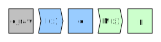
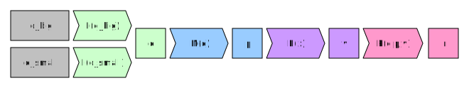

================================================
Chapter 1: Understanding data analysis workflows
================================================

**********************
Data analysis pipeline
**********************

Data analysis workflows are commonly split to four steps:

1. Data perparation and loading
2. Modeling
3. Evaluation
4. Presentation

From now on will call this the **data analysis pipeline**.

Data preparation and loading
============================

Data preparation and loading represents the process of preparing your
data into a format that is usable for analysis. One might think that
this is a very simple procedure, but in reality it is usually the most
time intensive part. Without proper data there can be no data analysis
and data is rarely provided in a format that is perfect to the task at
hand.

Cleaning up data, combining it with other data and creating a
efficient data pipeline depends heavily on the task at hand and thus
it requires a lot of manual effort. Badly done data preparation will
also propagate throughout the data analysis pipeline.

Let's call the input data ``d_raw`` and let's denote our input data
processing steps as ``I(x)``. After we have run the data processing we
will obtain a clean version of data called ``d``. So basically,
``d = I(d_raw)``.

Modeling
========

Modeling in this context refers to applying some algorithm, model or
statistics calculation to the data. So based on the data ``d``, we
apply some model ``M(x)`` to the data and we obtain an output parameters
``p``. Here output ``p`` can mean anything from statistics (e.g. mean, var)
to fit coefficients. So basically, ``p=M(d)``.

The process of choosing a suitable model based on our problem and
obtaining the output ``p`` is what is usually thought of being the whole
data analysis, but the whole data analysis pipeline contains other
steps as well.

Evaluation
==========

After we have obtained the output ``p`` from our model we need to
evaluate whether our model suits the task at hand. This step can be
automatic (we choose best performing model based on fit performance,
we test model on test data) or manual (we look at the parameters, we look
at a plot of fit). Let's call this step as ``E(x)`` and its output
values as ``v``. So again, ``v=E(p)``.

Presentation
============

The last step of our pipeline is to present our results in a suitable
format. This might include the creation of tables, plots or even interactive
widgets. Let's call this step ``P(data, parameters, evaluation)`` and
just for clarity let's use all of our collected knowledge of the problem
as an input. The output result ``r`` is now our finished product that
we'll show to our colleagues, put into our paper etc. So basically,
``r=P(d,p,v)``.

Now we have our finished pipeline. Now let's investigate why this is
important.

***********************************************************
Modularity & Interfacing - Why pipeline design is important
***********************************************************

Thinking about a data science problem in a pipeline form is important
because it highlights two important features:

1. Modularity
2. Interfacing

Modularity
==========

Modularity means that instead of having one big function or script to
handle the whole pipeline you have multiple independent pieces. In our
example pipeline we had functions ``I(x)``, ``M(x)``, ``E(x)`` and
``P(d,p,v)`` that independently handled specific parts of the pipeline.

For example, consider the situation where we have a multiple similar, but
separate, datasets that we want to analyze independently. Now if our
input parsing function ``I(x)`` can take any of these datasets the pipeline
can easily data-parallelized (more on this later).

.. image:: images/pipeline-modularity-1.svg

Of course we could write an input parser that works on all of the
datasets at the same time and in some cases this might be preferable.

As another example let's consider a problem where we would like to first
test the analysis modules of our pipeline on a subset of our original data
(e.g. stored in a file), but the actual data we want to analyze is stored
in a data store (e.g. SQL, Hadoop, data lake). This kind of a situation
is very common in industry.

Another place where modularity will show its imporance is a case where
there's multiple models that needs to be evaluated (e.g. ensemble modeling).
By creating independent models that each accept the input data and produce
an output that can be evaluated by the evaluation module we can reuse
most of our pipeline with minimal changes.

.. image:: images/pipeline-modularity-3.svg

Modularity is important as it allows us to re-use pieces of our pipeline
on various different tasks. It also makes testing and verifying our results
easier as we can test individual pieces of our program independently.

Modularity in the wild
======================

Pandas as a library has been designed with modularity in mind right from
the start. Each function in it has a specific task they need to accomplish
and the output is usually of the same type as the input. Functions are short
and the API tries to be as clean as possible. See slides 9, 13, 17 and 18 from
Wes McKinney's (pandas creator)
`presentation in NYCPython conference in 2012 <https://wesmckinney.com/blog/nycpython-1102012-a-look-inside-pandas-design-and-development/>`_ for more information.

Same can be said about R's tidyverse ecosystem. The ecosystem is designed
to use simple functions with human-readable names. See Hadley Wickham's
(tidyverse creator)
`tidy tools manifesto <https://tidyverse.tidyverse.org/articles/manifesto.html>`_
for more information.

Interfacing
===========

Modularity as a design principle is all fine and good, but for it to be really
effective, there needs to be good communication between the modules. This means
that there should be well defined interfaces between modules or, in other words,
for each module the output of the module should be in a format that can be
used as an input for the next module.

In the previous example of a pipeline with two models ``M1(x)`` and ``M2(x)``
we implicitly assumed that the model evaluation function ``E(x)`` could
read in the output of the models.

.. image:: images/pipeline-modularity-3.svg

As an example, in R the
`residuals-function <https://www.rdocumentation.org/packages/stats/versions/3.6.2/topics/residuals>`_
is defined for all model fitting functions and it will provide model
residuals. Thus if our evaluation function were to use
`residual sum of squares <https://en.wikipedia.org/wiki/Residual_sum_of_squares>`_
as a criterion of model evaluation, it would work with **all models that have a
residuals-function**. This is an example of a good interface.

Interfacing in the wild
=======================

Both pandas and R's tidyverse try to utilize a consistent strategy with data
structures. In pandas functions usually taka a ``Series``- or
``DataFrame``-objects and as their output they usually provide a similar
object. In R's tidyverse tries to do the same with ``tibble``-structures. By
having a consistent data type throughout the data analysis pipeline coding
becomes much easier: the API's just work.

This is also extremely important in the industry. Analyzing big data requires
good interfaces. For a good example, see
`Steve Yegge's rant on Google's platforms and on Jeff Bezos' 2002 interface mandate <https://gist.github.com/chitchcock/1281611>`_.
